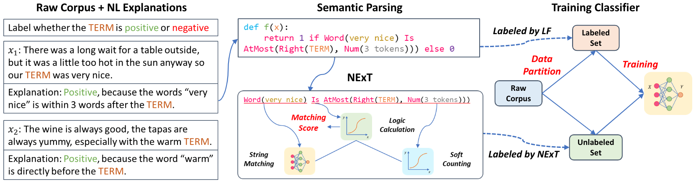

# Learning from Explanations with Neural Execution Tree

This code is for ICLR2020 paper: [Learning from Explanations with Neural Execution Tree](https://openreview.net/forum?id=rJlUt0EYwS).

## Contents

- [Introduction](#Introduction)
- [Requirments](#Requirments)
- [Run](#Run)
    - [Usage](#Usage)
    - [Running process](#Runningprocess)
- [Code Overview](#CodeOverview)
    - [CCG folder](#CCGfolder)
    - [Root foler & models folder](#Root)
    - [OtherExplanations](#OtherExplanations)
- [Cite](#Cite)

<h2 id="1">Introduction</h2>
While deep neural networks have achieved impressive performance on a range of NLP tasks, these data-hungry models heavily rely on labeled data. To make the most of each example, previous work has introduced natural language (NL) explanations to serve as supplements to mere labels. Such NL explanations can provide sufficient domain knowledge for generating more labeled data over new instances, while the annotation time only doubles. However, directly applying the NL explanations for augmenting model learning encounters two challenges.

First, NL explanations are unstructured and inherently compositional, which asks for a modularized model to represent their semantics. Second, NL explanations often have large numbers of linguistic variants, resulting in low recall and limited generalization ability when applied to unlabeled data.

 In this paper, we propose a novel Neural Execution Tree (NExT) framework for augmenting sequence classification with NL explanations. First, we transform NL explanations into executable logical forms using a semantic parser.  NExT then employs a neural module network architecture to generalize the different types of actions (specified by the logical forms) for labeling data instances and accumulates the results with soft logic, which substantially increases the coverage of each NL explanation. Experiments on two NLP tasks, relation extraction, and sentiment analysis, demonstrate its superiority over baseline methods by leveraging NL explanation. Its extension to multi-hop question answering achieves performance gain with light annotation effort.

Also, NExT achieves much better performance compared to traditional label-only supervised models in the same annotation time.

The overall framework is as follows:



<h2 id="Requirments">Requirments</h2>
tensorflow-gpu == 1.10 with CUDA 9.0

(or tensorflow-gpu==1.14 with CUDA10.0)

nltk == 3.4.4

stanfordcorenlp

**NOTE: tf 1.14 and 1.10 could not run on CUDA10.1 and errors will occur under such situation.**

<h2 id="Run">Run</h2>
<h3 id="Usage">Usage</h3>

* put TACRED (```train.json, dev.json and test.json```) into ```./data/tacred```. Due to LICENSE limit, we can't distribute dataset, you can download it here: https://catalog.ldc.upenn.edu/LDC2018T24.

* modify nltk source code:  in ```nltk/parse/chart.py```,  line 680, modify function ```parse```, change ```for edge in self.select(start=0, end=self._num_leaves,lhs=root):```  to  ```for edge in self.select(start=0, end=self._num_leaves):``` .

* download stanford-corenlp-full-2018-10-05(https://stanfordnlp.github.io/CoreNLP/history.html)，put it in ```./```.

* ```cd CCG
    python parser.py
    python get_data_for_classifier.py
    mv TK* ../data/tacred
    mv explanations.json ../data/tacred
    mv exp2pat.json ../```

* ```cd ../data/tacred
    python generate_pre.py
    EXPORT PYTHONPATH=$PYTHONPATH:<project_dir>/NExT/
    python data_process.py
    cd ../../
    python tacred.py --gpu <gpu_id>```

<h3 id="Runningprocess">Running process</h3>
The overall training process is as follows:

we will first use ```Parser.py``` to do semantic parsing, then use ```sl.py``` to train & eval model. 

<h2 id="CodeOverview">Code Overview</h2>
<h3 id="CCGfolder">CCG folder</h3>

This folder is for semantic parsing.

```Parser.py``` will read explanations and parse the explanations into many logic forms, then use beam search, feature training to find the correct one and dump them. 

``constant.py`` defines CCG syntax and semantics.

```soft_constant.py``` defines NExT modules.

<h3 id="Root">Root folder & models folder</h3>
These two folders are for model training and evaluation.

```tacred.py``` defines many hyperparameters and is main function.

 ```sl.py``` is the training & eval process.
```models/softmatch.py``` defines NExT model and will be used in ```sl.py```.

<h3 id="OtherExplanations">OtherExplanations</h3>
We offer other 3 datasets' explanations here, i.e. SemEval, Restaurant and Laptop. For people to reproduce other 3 datasets' results.

To run this code on other datasets, you need to modify some constants (e.g. dictionary that maps relation to id) and hyperparameters(listed in paper Appendix), and do datapreprocess. 

(Note: TACRED explantions is in ```./CCG```)

<h2 id="Cite">Cite</h2>
Please cite our paper if the paper and code helps you:

```
@inproceedings{
Wang*2020Learning,
title={Learning from Explanations with Neural Execution Tree},
author={Ziqi Wang* and Yujia Qin* and Wenxuan Zhou and Jun Yan and Qinyuan Ye and Leonardo Neves and Zhiyuan Liu and Xiang Ren},
booktitle={International Conference on Learning Representations},
year={2020},
url={https://openreview.net/forum?id=rJlUt0EYwS}
}
```